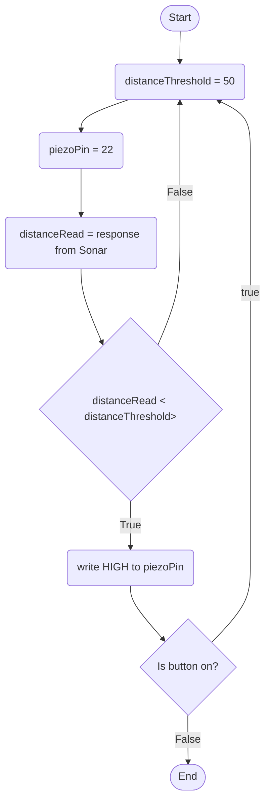
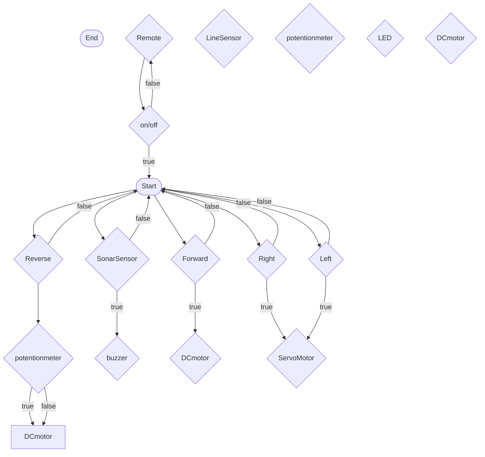

```mermaid
flowchart TD
terminalStart([Start])
terminalEnd([End])

thresholdSet(distanceThreshold = 50)
setPiezoPin(piezoPin = 22)
currentDistanceReading(distanceRead = response from Sonar)
activatePiezo(write HIGH to piezoPin)
ifDistanceLessThanThreshold{distanceRead < distanceThreshold>}
ButtonLogic{Is button on?}

terminalStart --> thresholdSet
thresholdSet --> setPiezoPin
setPiezoPin --> currentDistanceReading
currentDistanceReading --> ifDistanceLessThanThreshold

ifDistanceLessThanThreshold --> |False| thresholdSet
ifDistanceLessThanThreshold --> |True| activatePiezo
activatePiezo --> ButtonLogic
ButtonLogic --> |true| thresholdSet
ButtonLogic --> |False| terminalEnd
```

```mermaid
flowchart TD
terminalStart([Start])
terminalEnd([End])

Remote{Remote}
ButtonUp{Forward}
ButtonLeft{Left}
ButtonRight{Right}
ButtonDown{Reverse}
ButtonMiddle{on/off}

Sonar{SonarSensor}
Line{LineSensor}
Potentionmeter1{potentionmeter}
Potentionmeter2{potentionmeter}
LED{LED}
Buzzer{buzzer}
DCmotor1{DCmotor}
DCmotor2{DCmotor}
ServoMotor{ServoMotor}

Remote --> ButtonMiddle
ButtonMiddle --> |true|terminalStart
ButtonMiddle --> |false|Remote

terminalStart --> ButtonUp
ButtonUp --> |false| terminalStart
ButtonUp --> |true| DCmotor1

terminalStart --> ButtonDown
ButtonDown --> Potentionmeter1
ButtonDown --> |false| terminalStart
Potentionmeter1 --> |true| DCmotor
Potentionmeter1 --> |false| DCmotor

terminalStart --> ButtonRight
ButtonRight --> |false| terminalStart
ButtonRight --> |true| ServoMotor

terminalStart --> ButtonLeft
ButtonLeft --> |false| terminalStart
ButtonLeft --> |true| ServoMotor

terminalStart --> Sonar 
Sonar --> |true| Buzzer
Sonar --> |false| terminalStart
```