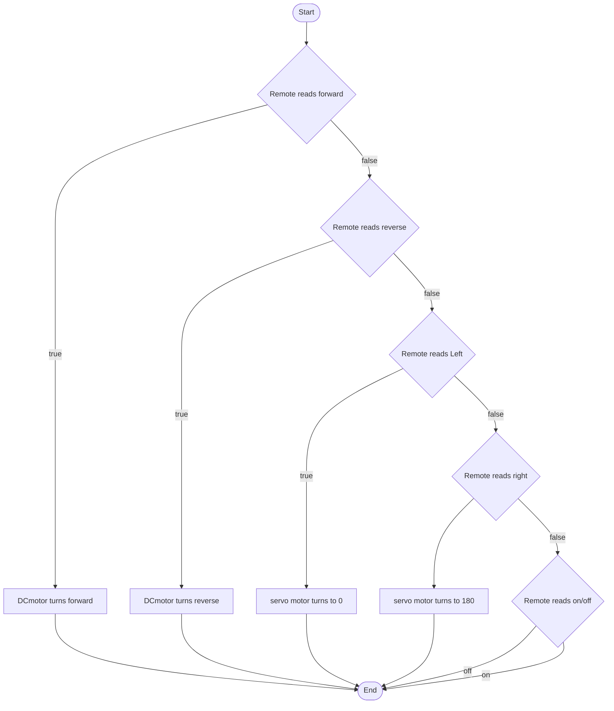

```mermaid

Sonar{SonarSensor}
Line{LineSensor}
Potentionmeter1{is potentionmeter in use?}
Potentionmeter2{is potentionmeter in use?}
LED{LED}
Buzzer{buzzer}
DCmotor1{DCmotor}
DCmotor2{DCmotor}

Remote --> ButtonMiddle
ButtonMiddle --> |true|terminalStart
ButtonMiddle --> |false|Remote
```

```mermaid
terminalStart --> ButtonUp
ButtonUp --> |false| terminalStart
ButtonUp --> |true| DCmotor1

terminalStart --> ButtonDown
ButtonDown --> |true| Potentionmeter1
ButtonDown --> |false| terminalStart
Potentionmeter1 --> |true| DCmotor2
Potentionmeter1 --> |false| DCmotor2
DCmotor2 --> DCreverse
DCreverse --> ButtonDown2{Is Reverse still held down}
ButtonDown2{Is Reverse still held down} --> |true| DCmotor2
ButtonDown2{Is Reverse still held down} --> |false| terminalStart

terminalStart --> ButtonRight
ButtonRight --> |false| terminalStart
ButtonRight --> |true| ServoMotor

terminalStart --> ButtonLeft
ButtonLeft --> |false| terminalStart
ButtonLeft --> |true| ServoMotor

terminalStart --> Sonar 
Sonar --> |true| Buzzer
Sonar --> |false| terminalStart
```