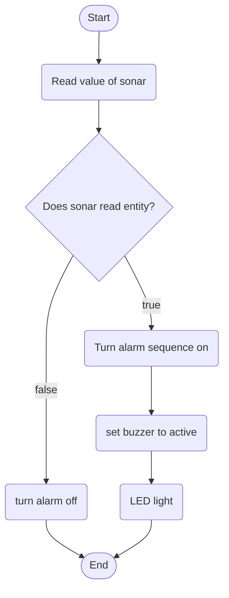
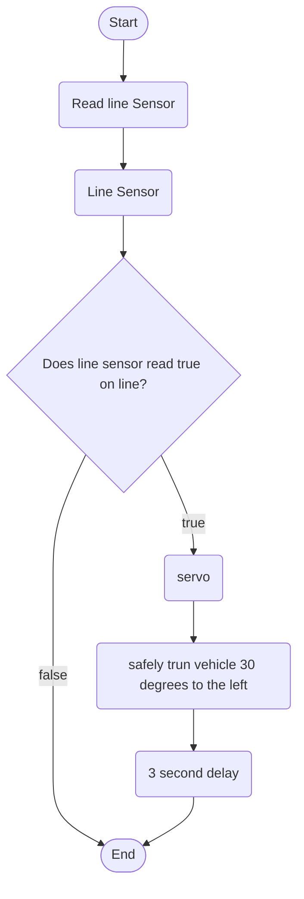
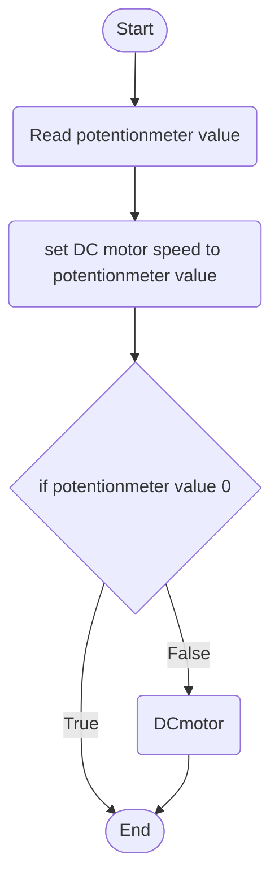

```mermaid
flowchart TD
terminalStart([Start])
terminalEnd([End])

ButtonUp{Remote reads forward}
ButtonLeft{Remote reads Left}
ButtonRight{Remote reads right}
ButtonDown{Remote reads reverse}
ButtonMiddle{Remote reads on/off}
DCReverse[DCmotor turns reverse]
DCForward[DCmotor turns forward]

ServoMotorLeft[servo motor turns to 0]
ServoMotorRight[servo motor turns to 180]


terminalStart --> ButtonUp
ButtonUp --> |true| DCForward
ButtonUp --> |false| ButtonDown
ButtonDown --> |true| DCReverse
DCForward --> terminalEnd
DCReverse --> terminalEnd

ButtonDown --> |false| ButtonLeft
ButtonLeft --> |true| ServoMotorLeft
ButtonLeft --> |false| ButtonRight
ButtonRight --> ServoMotorRight
ServoMotorRight --> terminalEnd
ServoMotorLeft --> terminalEnd

ButtonRight --> |false| ButtonMiddle
ButtonMiddle --> |off| terminalEnd
ButtonMiddle --> |on| terminalEnd
```

```mermaid
flowchart TD
terminalStart([Start])
terminalEnd([End])

TurnSequenceOn(Turn alarm sequence on)
TurnAlarmOff(turn alarm off)
ReadValueOfSonar(Read value of sonar)
Sonar{Does sonar read entity?}
Buzzer(set buzzer to active)
LED(LED light)

terminalStart --> ReadValueOfSonar
ReadValueOfSonar--> Sonar
Sonar --> |true| TurnSequenceOn
TurnSequenceOn --> Buzzer
Buzzer --> LED
Sonar --> |false| TurnAlarmOff
TurnAlarmOff --> terminalEnd
LED --> terminalEnd
```

```mermaid
flowchart TD
terminalStart([Start])
terminalEnd([End])

DoesSensorReadLine{Does line sensor read true on line?}
ReadLineSensor(Read line Sensor)
Line(Line Sensor)
Servo(servo)
TurnServo30Degrees(safely trun vehicle 30 degrees to the left)
3SecondDelay(3 second delay)

terminalStart --> ReadLineSensor
ReadLineSensor --> Line
Line --> DoesSensorReadLine{Does line sensor read true on line?}
DoesSensorReadLine{Does line sensor read true on line?} --> |false| terminalEnd
DoesSensorReadLine{Does line sensor read true on line?} --> |true| Servo
Servo --> TurnServo30Degrees
TurnServo30Degrees --> 3SecondDelay
3SecondDelay --> terminalEnd
```

```mermaid
flowchart TD
terminalStart([Start])
terminalEnd([End])

DCmotor(DCmotor)
ReadPotentionmeter(Read potentionmeter value)
Value0{if potentionmeter value 0}
SetValue(set DC motor speed to potentionmeter value)

terminalStart --> ReadPotentionmeter
ReadPotentionmeter --> SetValue
SetValue --> Value0
Value0 --> |True| terminalEnd
Value0 --> |False| DCmotor
DCmotor --> terminalEnd

```